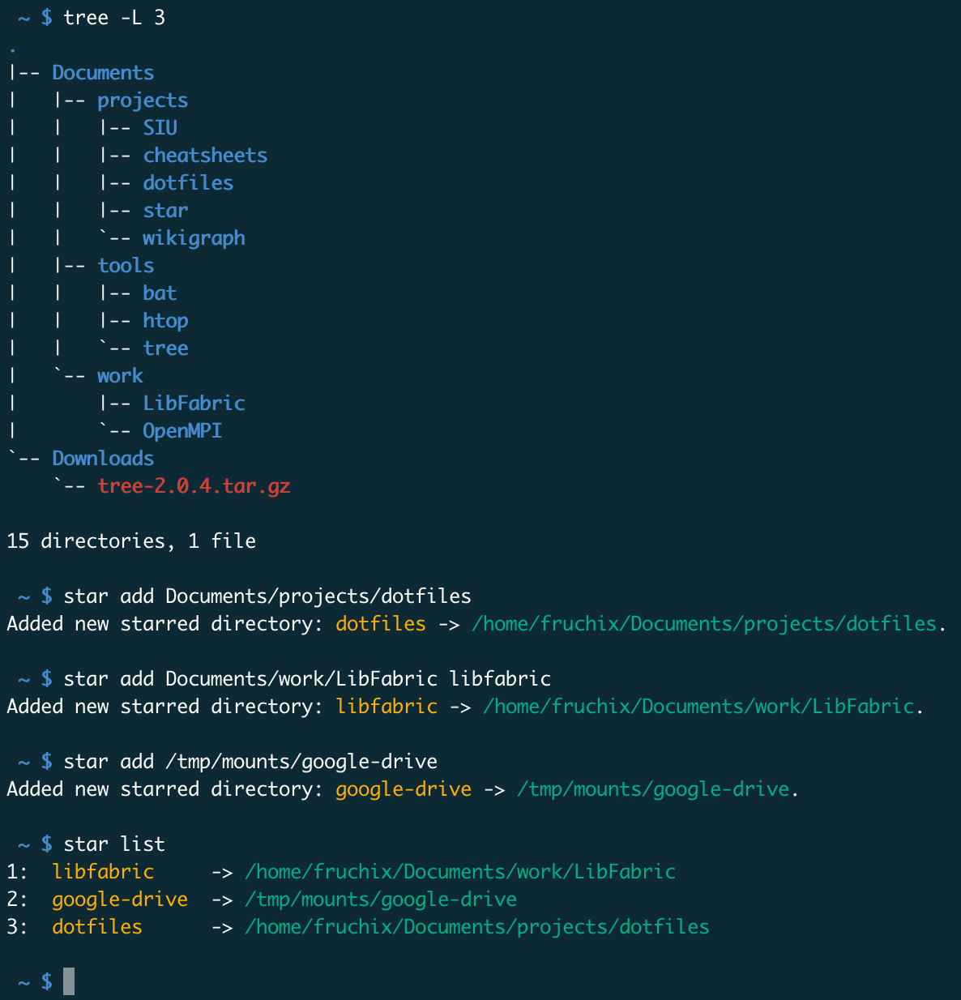
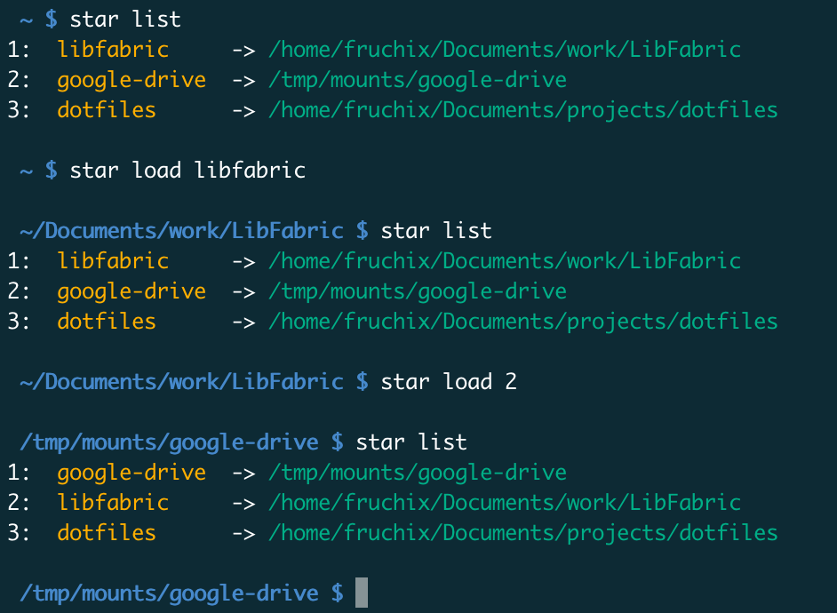
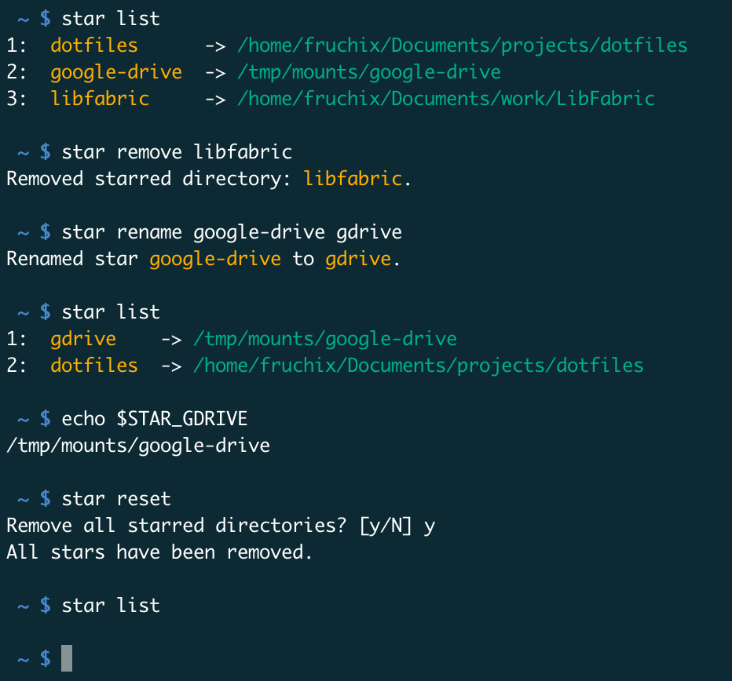
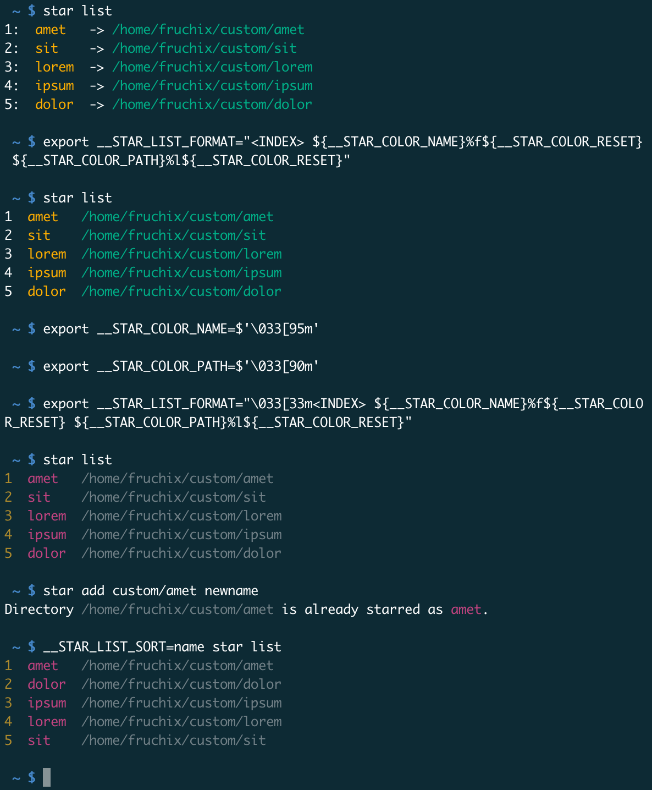

<h1>star</h1>

star is a Unix CLI tool that allows you to bookmark your favorite folders and instantly navigate to them.

It is written in pure Bash, but can be used with Zsh as long as there is an available Bash version (>= 3.2).

<h2>Table of contents</h2>

- [Features](#features)
- [Installation](#installation)
  - [Requirements](#requirements)
  - [Installing](#installing)
  - [Uninstalling](#uninstalling)
- [Configuration](#configuration)
- [Troubleshooting](#troubleshooting)
- [Contributions and development](#contributions-and-development)
  - [Future work](#future-work)
  - [Pull requests](#pull-requests)
  - [Testing](#testing)
- [Contributors](#contributors)
- [License](#license)

## Features

  
Dynamically add bookmarks (called "stars")

  

    
  

  
Instantly navigate into your favorite directories

  

    
  

  > The output of `star list` is sorted according to when each element was loaded last (this can be configured).

  
Autocompletion is your friend

  

    
  

  
Use the generated environment variables to interract with your directories

  

    
  

  
Manage your stars

  

    
  

  
Customize colors, listing and more

  

    
  

## Installation

### Requirements

### Installing

### Uninstalling

## Configuration

## Troubleshooting

## Contributions and development
<!-- Contributions are welcome! Please submit issues or pull requests to improve star. -->

### Future work

<!-- TODO: checklist -->

### Pull requests

<!-- TODO -->

### Testing

<!-- TODO -->

## Contributors

Special thanks to [@PourroyJean](https://www.github.com/PourroyJean) for contributing to this project.

## License

[Apache](./LICENSE)  
> Copyright 2025 Fruchix
